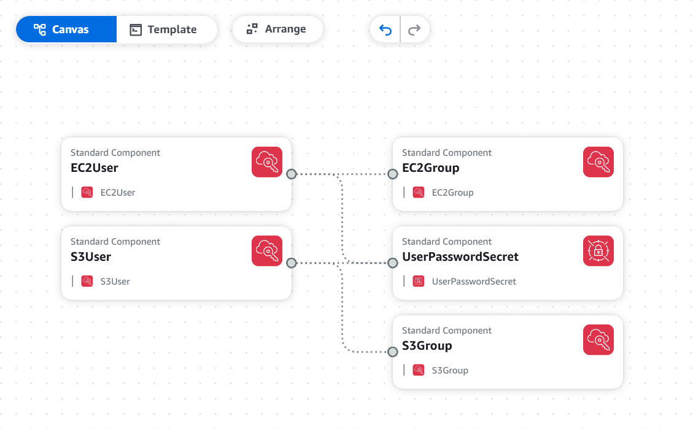

# Automating Creation of IAM Resources with CloudFormation and GitSync

## 📌 Overview

This lab demonstrates how to automate the creation of IAM users, groups,
and permissions using **AWS CloudFormation** with GitSync integration.


------------------------------------------------------------------------

## 📊 Diagram



------------------------------------------------------------------------

## 📝 Deploy


1.  Clone this repository.

2.  Deploy the CloudFormation template:

    ``` bash
    aws cloudformation create-stack \     
    --stack-name iam-resources-stack \     
    --template-body file://infra.yaml \     
    --capabilities CAPABILITY_NAMED_IAM
    ```

3.  CloudFormation will provision:

    -   A Secrets Manager entry with the one-time password.
    -   Two IAM groups with relevant managed policies.
    -   Two IAM users with console login enabled and assigned to groups.

------------------------------------------------------------------------

